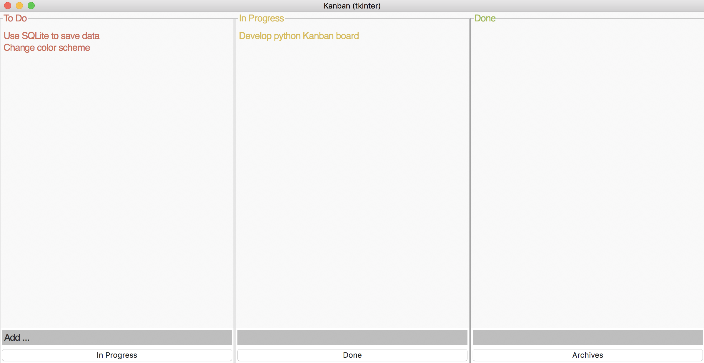
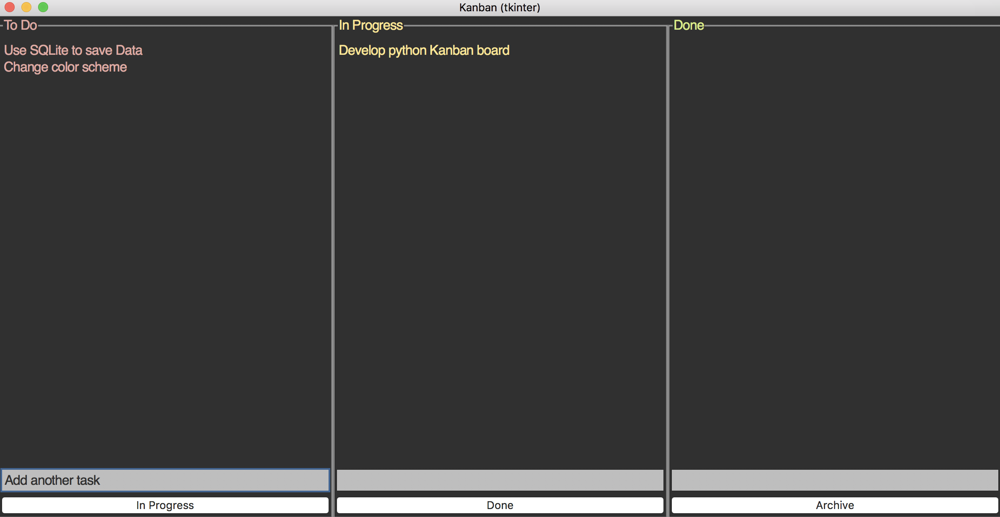

# Kanban (tkinter)

A simple Kanban Board made with Python and `tkinter`.




## Feature list

+ Add tasks to any stage (To Do, In Progress, Done)
+ Delete selected tasks by pressing the delete key
+ Use arrow keys to move around
+ Use Command + arrow keys to move tasks around
+ Export the board to a CSV file with "Command-E"
+ Insert new tasks with "Command-I"


# Development

## Setup using conda

```bash
# List your python envs
$ conda env list

# Create new python envs
$ conda env create --prefix ./ops/pyenv/kanban_env --file ./environment.yml

# Init your shell to use conda activate
$ conda init
$ conda init zsh

# Activate your new created python env
$ conda activate ./ops/pyenv/kanban_env
```

## Windows [Optional]

## Linux [Optional]

## macOS [Optional]

When trying to start the `DearPyGUI` app it's possible that you encounter the following error: 

> Library not loaded: /usr/local/opt/libpng/lib/libpng16.16.dylib

```bash
# Check if the file exsits
$ ls -la /usr/local/opt/libpng/lib/libpng16.16.dylib

# Install the libpng using brew
$ brew install libpng
```
